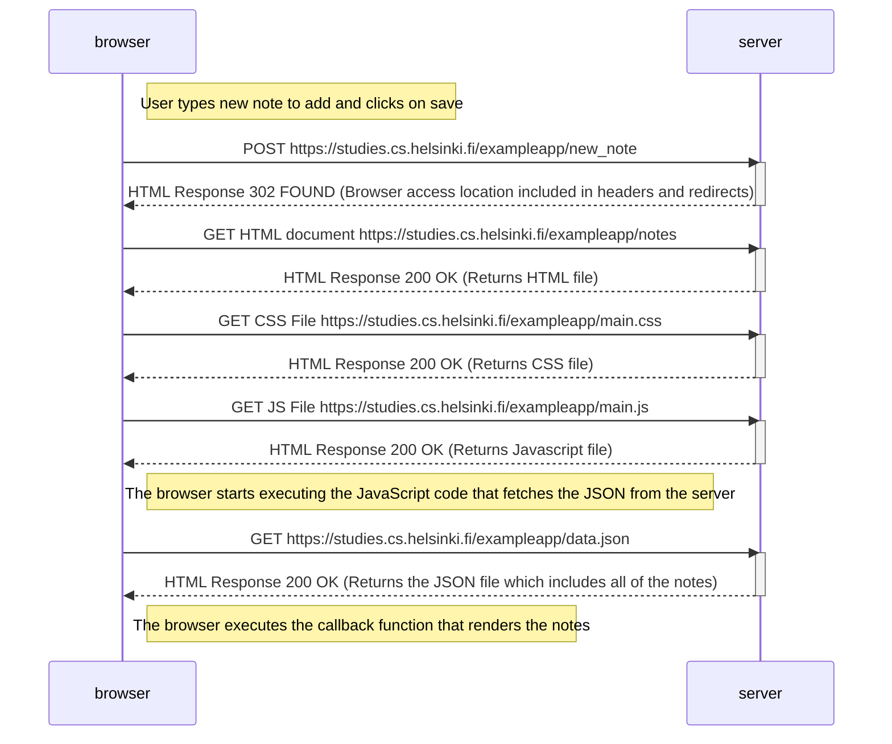

```mermaid
sequenceDiagram
    participant browser
    participant server

    Note right of browser: User types new note to add and clicks on save

    browser->>server: POST https://studies.cs.helsinki.fi/exampleapp/new_note
    activate server
    server-->>browser:  HTML Response 302 FOUND (Browser access location included in headers and redirects) 
    deactivate server


    browser->>server: GET HTML document https://studies.cs.helsinki.fi/exampleapp/notes
    activate server
    server-->>browser: HTML Response 200 OK (Returns HTML file)
    deactivate server

    browser->>server: GET CSS File https://studies.cs.helsinki.fi/exampleapp/main.css
    activate server
    server-->>browser: HTML Response 200 OK (Returns CSS file)
    deactivate server

    browser->>server: GET JS File https://studies.cs.helsinki.fi/exampleapp/main.js
    activate server
    server-->>browser: HTML Response 200 OK (Returns Javascript file)
    deactivate server

    Note right of browser: The browser starts executing the JavaScript code that fetches the JSON from the server

    browser->>server: GET https://studies.cs.helsinki.fi/exampleapp/data.json
    activate server
    server-->>browser: HTML Response 200 OK (Returns the JSON file which includes all of the notes)
    deactivate server

    Note right of browser: The browser executes the callback function that renders the notes
```