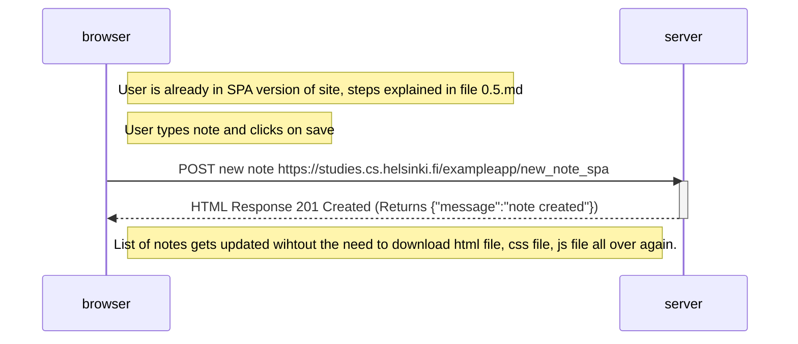

```mermaid
sequenceDiagram
    participant browser
    participant server

    Note right of browser: User is already in SPA version of site, steps explained in file 0.5.md
    Note right of browser: User types note and clicks on save

    browser->>server: POST new note https://studies.cs.helsinki.fi/exampleapp/new_note_spa
    activate server
    server-->>browser:  HTML Response 201 Created (Returns {"message":"note created"}) 
    deactivate server

    Note right of browser: List of notes gets updated wihtout the need to download html file, css file, js file all over again.
```